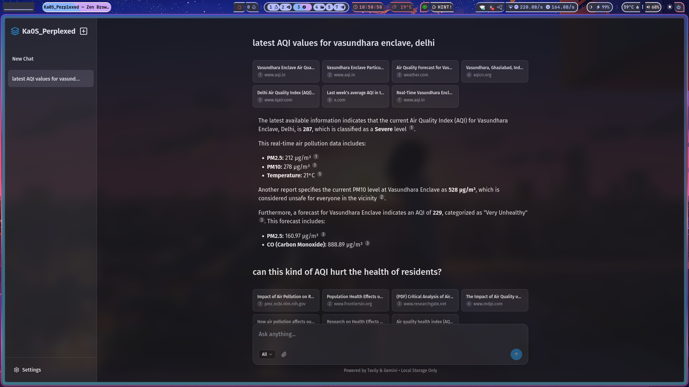
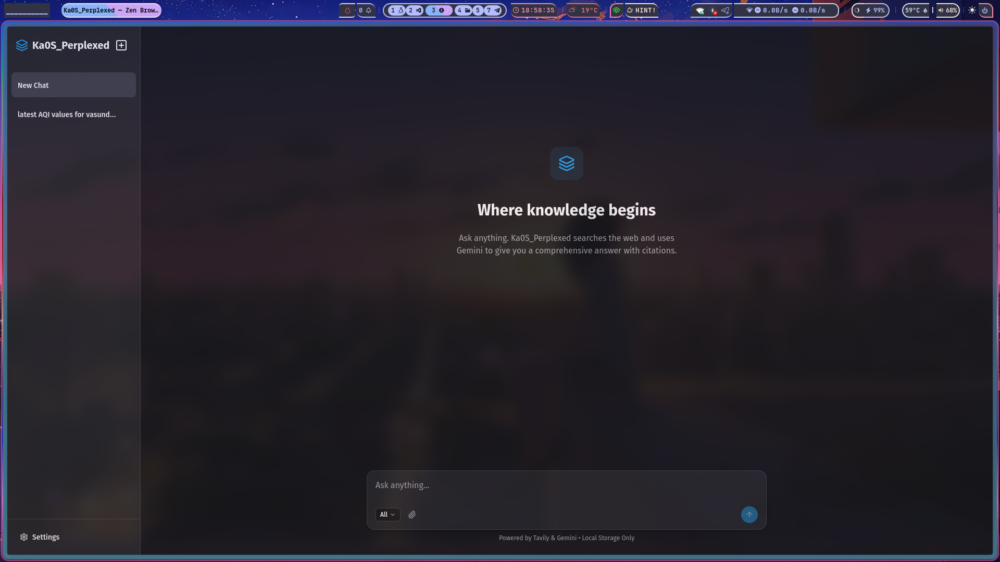
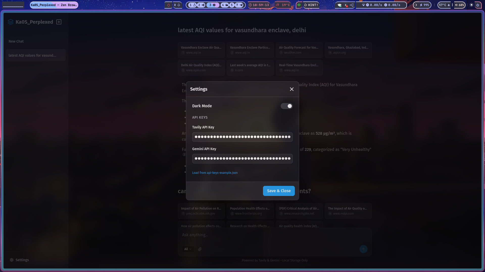
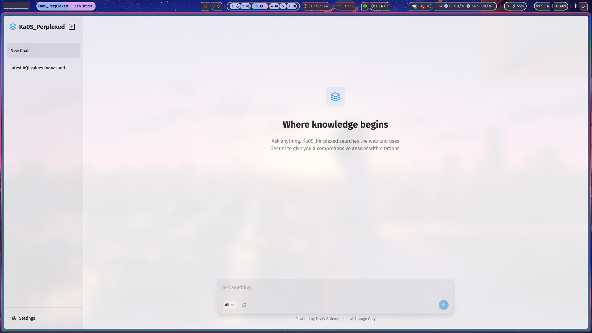

# 🌀 Ka0S_Perplexed

**Ka0S_Perplexed** is a lightweight, single-file AI search engine inspired by Perplexica. It combines the power of **Google Gemini** for reasoning and **Tavily** for real-time web search to provide comprehensive, cited answers to your questions.

Everything runs locally in your browser—no backend server required.

## ✨ Features

- **🚀 Single File**: The entire app is contained in one `perplexed.html` file.
- **🔍 Smart Search**: Uses Tavily to fetch up to 7 relevant sources from the web.
- **🤖 AI Powered**: Uses **Google Gemini 2.5 Flash** with an expanded **8k token window** for deep, comprehensive answers and robust JSON reasoning.
- **🧠 Self-Feedback Search Loop**:
  - **Auto-Refinement**: Gemini automatically evaluates search results and refines queries if needed (up to 2 searches).
  - **Search Deeper**: Click to perform comprehensive 4-search deep dive with AI-generated queries for better answers.
  - **Real-time Status**: Watch search progress with live status updates.
- **🎯 Focus Modes**:
    - **All**: General web search.
    - **Academic**: Prioritizes scholarly papers and articles.
    - **YouTube**: Finds relevant videos.
    - **Reddit**: Searches discussions and threads.
    - **Writing Assistant**: Chat directly with Gemini (no search).
    - **Wolfram Alpha**: Computational knowledge search.
- **💬 Conversation Continuity**: Chat history persists within each session, allowing Gemini to maintain context across multiple queries and focus mode changes.
- **💾 Local Storage**: Your chat history and API keys are stored securely in your browser.
- **🌗 Dark Mode**: Built-in dark and light themes.
- **📁 Multimodal File Support**: Attach **Images, PDFs, Videos, and Text files**. Gemini analyzes their content to generate relevant search queries and provide context-aware answers.
- **📱 Responsive**: Works great on desktop and mobile.

## 🧠 How Search Refinement Works

### Automatic Refinement (Default)
Every search automatically:
1. **Searches** using your query (1/2)
2. **Evaluates** if results are comprehensive enough
3. **Refines** if needed by generating a better search query
4. **Searches again** with improved query (2/2)
5. **Combines & deduplicates** results
6. **Generates** a comprehensive answer

You'll see status messages: `Searching (1/2)... → Evaluating search quality... → Refining search... → Searching (2/2)...`

### Search Deeper (Manual)
For more comprehensive research, click the **🔍 Search Deeper** button below any answer:
1. Starts with your original query
2. AI generates 3 additional refined search queries
3. Performs 4 total searches (1/4, 2/4, 3/4, 4/4)
4. Combines all results with deduplication
5. Regenerates answer with expanded context

Perfect for complex topics, research papers, or when you need maximum accuracy.

**Budget**: With Tavily's 1000 monthly queries, you can perform ~250 deep searches!

## 📸 Screenshots

### Main Chat Interface


### New Chat Session


### Settings Panel


### Light Mode Theme


## 🛠️ Setup

1.  **Download**: Save the `perplexed.html` file to your computer.
2.  **Get API Keys**:
    - **Tavily API Key**: Get one from [tavily.com](https://tavily.com/).
    - **Gemini API Key**: Get one from [aistudio.google.com](https://aistudio.google.com/).
3.  **Run**: Double-click `perplexed.html` to open it in your browser.
4.  **Configure**:
    - Click the **Settings** (gear icon) in the sidebar.
    - Enter your keys manually OR load them from a JSON file (see below).

### 🔑 API Keys JSON (Optional)

You can create a file named `api-keys-example.json` to quickly load your keys:

```json
{
  "tavily": "tvly-YOUR_KEY_HERE",
  "gemini": "AIzaSy-YOUR_KEY_HERE"
}
```

## 🏗️ Tech Stack

- **HTML5**: Structure.
- **Tailwind CSS**: Styling (via CDN).
- **Alpine.js**: Reactivity and state management.
- **Marked.js**: Markdown rendering.
- **DOMPurify**: Security and sanitization.

## ⚠️ Note

Since this is a client-side application using CDNs, it requires an internet connection to load libraries and make API calls. API keys are stored in your browser's `localStorage` and are never sent to any server other than the respective API providers (Google and Tavily).

> [!NOTE]
> You may see a console warning about `cdn.tailwindcss.com`. This is expected for a portable single-file application and does not affect functionality.

---
*Inspired by [Perplexica](https://github.com/ItzCrazyKns/Perplexica).*
